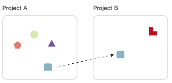

# 모노레포

여러 프로젝트를 관리하는 경우에는 일반적으로 개별 프로젝트마다 별도의 레포지토리(repository)를 생성하여 관리한다. 이때, 프로젝트마다 고유하고 독리적인 코드가 존재한다면 통합이 필요하지 않을 수도 있다. 하지만 공통된 요소를 찾아낼 수 있다면 이를 통합하여 조금 더 효율적으로 관리할 수 있다. 이 절에서는 여러 프로젝트를 관리하는 상황에서 공통적인 요소를 통합하는 과정을 살펴본다.

## 분산된 구조의 문제점

3개의 독립적인 프로젝트가 있다고 가정해보자. 개발자는 각각의 레포지토리에서 해당 프로젝트를 위한 Jest, 바벨, ESLint, 타입스크립트 등의 설정 파일을 별도로 구성하고 빌드 파이프라인, 공통적인 컴포넌트 그리고 해당 프로젝트에 필요한 소스코드를 독립적으로 관리하고 있다. 이러한 상황에서 만약 프로젝트에 필요한 기능이 다른 프로젝트에 존재한다면 아래 그림과 같이 단순히 해당 기능을 복사하여 붙여넣기 함으로써 빠르게 구현할 수 있다.

이런 과정을 통해 개발 시간을 아낄 수 있지만 프로젝트 관리 측면에서 어려움이 생기기도 한다. 예를 들어, 여러 프로젝트에 동일한 코드를 복사하여 붙여 넣은 후에 뒤늦게 새로운 버그가 발견되거나 기능 확장을 위해 해당 기능을 수정해야 할 때 프로젝트의 개수만큼 반복적인 수정 작업을 해야 한다. 특정 라이브러리에 문제가 생기거나 더 이상 사용되지 않는 경우에도 마찬가지로 모든 프로젝트에서 일일이 대응해야 한다. 
따라서 개발자가 변경이 필요한 지점을 모두 인지하고 있어야 하기 때문에 개발자 경험(DX)이 저하될 수 있다. 장기적으로도 프로젝트 관리가 어려워지면서 업무 효율이 갈수록 악화되는 현상이 발생하게 된다.

이처럼 분산된 구조는 생산성을 떨어뜨리는 결과를 초래한다. 이런 상황에서 벗어나기 위해서는 반복되는 코드를 함수화하여 통합하듯이 한 곳에서 프로젝트를 관리할 수 있도록 통합해야 한다.

## 통합할 수 있는 요소 찾기

모든 요소를 통합할 수 있다면 이상적이겠지만, 완전히 동일한 프로젝트가 아니라면 프로젝트마다 다른 요소가 존재하기 마련이다. 따라서 먼저 프로젝트 내에서 공통으로 통합할 수 있는 요소를 찾아야 한다.

## 공통 모듈화로 관리하기

소스코드를 수정한 다음에 모듈화를 통해 통합할 수 있다. 이 과정에서 npm과 같은 패키지 관리자를 활용하여 공통 모듈을 생성하고 관리한다면 각 프로젝트에서 간편하게 모듈과 의존성을 맺고 사용할 수 있게 된다. 새로운 프로젝트를 시작하더라도 모듈을 통해 코드를 재사용할 수 있으며, 특정 기능의 변경이 필요할 때는 해당 모듈의 소스코드만 수정하면 되기 때문에 유지보수도 쉬워진다.

공통 모듈화를 통해 단순한 코드 복사 작업은 줄었지만 여전히 아쉬운 점이 있다. 만약 공통 모듈에 변경이 발생한다면 해당 모듈을 사용하는 프로젝트에서도 추가 작업이 필요할 수 있다. 또한 공통 모듈의 개수가 늘어나면 관리해야 할 레포지토리도 그만큼 늘어난다.

새로운 공통 모듈이 필요하다면 개발자는 새로운 레포지토리를 생성하고 개발 환경을 설정하며 패키지 관리자를 사용하여 모듈을 게시해야 한다. 새로운 프로젝트를 시작할 때도 빌드를 위한 CI/CD 파이프라인, Lint, 테스트 등도 별도로 설정해야 한다.

## 모노레포의 탄생

**모노레포(Monorepo)**란 버전 관리 시스템에서 여러 프로젝트를 하나의 레포지토리로 통합하여 관리하는 소프트웨어 개발 전략이다. 이전에는 다양한 기능을 가진 프로젝트를 하나의 레포지토리로 관리하는 모놀리식(Monolithic) 기법을 주로 사용했다. 하지만 모놀리식 구조는 코드 간의 직접적인 의존이 발생하여 일부 로직만 변경될 때도 전체 프로젝트에 영향을 줄 수 있다. 이에 따라 설계적인 측면과 빌드 및 배포 등에서 효율적이지 못했다.

당연하게도 효율적인 구조에 대한 수요가 생겼고 거대한 프로젝트를 작은 프로젝트의 집합으로 나누어 관리하는 폴리레포(polyrepo) 방식과 하나의 레포지토리로 모든 것을 관리하는 모노레포 방식이 등장하게 되었다. 최근에는 작은 프로젝트에서도 번들러, 테스트, Lint, CI/CD 스크립트나 도커 등 다양한 설정을 적용한다.

이러한 상황에서 모노레포를 사용하면 개발 환경 설정도 통합할 수 있어서 더 효율적인 관리가 가능해진다. 요즘은 많은 프로젝트에서 모노레포를 채택하고 있다.

### 모노레포로 관리했을 때의 장점

모노레포는 앞서 설명한 대로 여러 프로젝트를 하나의 레포지토리로 통합하여 관리하며, 프로젝트마다 개별적인 레포지토리를 만드는 방식과는 달리 Lint, CI/CD 등 개발 환경 설정도 통합적으로 관리하기 때문에 불필요한 코드 중복을 줄여준다.

개별적으로 프로젝트를 형성하는 폴리레포와는 다르게 공통 모듈도 동일한 프로젝트 내에서 관리되므로 별도의 패키지 관리자를 통해 모듈을 게시하지 않아도 된다. 이에 따라 기능 변화를 쉽게 추적하고 의존성을 관리할 수 있게 된다.

### 모노레포로 관리했을 때의 단점

모노레포로 프로젝트를 관리할 때 시간이 지나면서 레포지토리가 거대해질 수 있다. 그리고 하나의 레포지토리에 여러 팀의 이해관계가 얽혀있다면 소유권과 권한 관리가 복잡해질 수 있다. 따라서 각 프로젝트나 모듈의 소유권을 명확히 정의하고 규칙을 설정해야 하는 과정이 별도로 필요하다.
