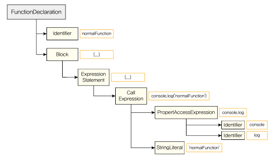
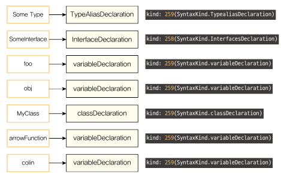

# 타입스크립트 컴파일러의 구조

실제 타입스크립트 컴파일러의 구성 요소를 훑어보며 타입스크립트 컴파일러의 동작 방식을 이해해보자.

컴파일러는 하나의 프로그램으로 이를 구현한 소스 파일이 존재한다. 타입스크립트 공식 깃허브에서 compiler라는 별도의 폴더로 구성된 타입스크립트 컴파일러를 찾아볼 수 있다. 해당 폴더는 타입스크립트 컴파일러가 동작하는 데 몇 가지 중요한 구성 요소를 가지고 있다. 타입스크립트 컴파일러의 구체적인 동작을 살펴보자.

타입스크립트 컴파일러는 다섯 단계를 거쳐 타입 검사와 자바스크립트 소스 변환을 진행한다. 각 단계에 대한 대략적인 개요는 다음과 같다.

1. 스캐너 : .ts 토큰화
2. 파서 : 토큰 기반 AST 생성
3. 바인더 : AST 노드 기반 심볼 생성
4. 체커 : AST + 심볼 기반 타입 검사
5. 이미터 : AST + 코드 검사 기반 .js 생성

## 프로그램(Program)

타입스크립트 컴파일러는 tsc 명령어로 실행된다. 컴파일러는 tsconfig.json에 명시된 컴파일 옵션을 기반으로 컴파일을 수행한다. 먼저 전체적인 컴파일 과정을 관리하는 프로그램 객체(인스턴스)가 생성된다. 이 프로그램 객체는 컴파일할 타입스크립트 소스 파일과 소스 파일 내에서 임포트된 파일을 불러오는데, 가장 최초로 불러온 파일을 기준으로 컴파일 과정이 시작된다.

## 스캐너(Scanner)

타입스크립트 소스를 자바스크립트로 변환하기 위한 첫 번째 단계는 스캐너이다. 스캐너는 타입스크립트 소스 파일을 어휘적으로 분석(lexical analysis)하여 토큰을 생성하는 역할을 한다. 다시 말해 소스코드를 작은 단위로 나누어 의미 있는 토큰으로 변환하는 작업을 수행한다.

```typescript
const woowa = "bros";
```

위의 변수를 선언하는 코드는 스캐너에 의해 다음과 같이 분석된다.


## 파서(Parser)

스캐너가 소스 파일을 토큰으로 나눠주면 파서는 그 토큰 정보를 이용하여 AST를 생성한다. AST는 컴파일러가 동작하는 데 핵심 기반이 되는 자료 구조로, 소스코드의 구조를 트리 형태로 표현한다. AST의 최상위 노드는 타입스크립트 소스 파일이며, 최하위 노드는 파일의 끝 지점(EndOfFileToken)으로 구성된다.

스캐너는 어휘적 분석을 통해 토큰 단위로 소스코드를 나누지만 파서는 이렇게 생성된 토큰 목록을 활용하여 구문적 분석(Syntax analysis)을 수행한다. 이를 통해 코드의 실질적인 구조를 노드 단위의 트리 형태로 표현한다. 각각의 노드는 코드상의 위치, 구문 종류, 코드 내용과 같은 정보를 담고 있다.

예를 들어 `( )`에 해당하는 토큰이 있을 때 파서가 AST를 생성하는 과정에서 이 토큰이 실질적으로 함수의 호출인지, 함수의 인자인지 또는 그룹 연산자인지가 결정된다.

```typescript
function normalFunction() {
  console.log("normalFunction");
}

normalFunction();
```

앞의 코드는 다음과 같은 구조로 AST를 구성한다.



## 바인더(Binder)

바인더의 주요 역할은 체커(Checker) 단계에서 타입 검사를 할 수 있도록 기반을 마련하는 것이다. 바인더는 타입 검사를 위해 심볼(Symbol)이라는 데이터 구조를 생성한다. 심볼은 이전 단계의 AST에서 선언(declaration)된 타입의 노드 정보를 저장한다. 심볼의 인터페이스 일부는 다음과 같이 구성된다.

```typescript
export interface Symbol {
  flags: SymbolFlags; // Symbol flags
  escapedName: string; // Name of symbol
  declarations?: Declaration[]; // Declarations associated with this symbol
  // ...
}
```

flags 필드는 AST에서 선언된 타입의 노드 정보를 저장하는 식별자이다. 심볼을 구분하는 식별자 목록은 다음과 같다.

```typescript
// src/compiler/types.ts
export const enum SymbolFlags {
  None = 0,
  FunctionScopedVariable = 1 << 0, // Variable (var) or parameter
  BlockScopedVariable = 1 << 1, // A block-scoped variable (let of const)
  Property = 1 << 2, // Property or enum member
  EnumMember = 1 << 3, // Enum member
  Function = 1 << 4, // Function
  Class = 1 << 5, // Class
  Interface = 1 << 6, // Interfaces
}
```

심볼 인터페이스의 declarations 필드는 AST 노드의 배열 형태를 보인다. 결과적으로 바인더는 심볼을 생성하고 해당 심볼과 그에 대응하는 AST 노드를 연결하는 역할을 수행한다.

다음은 여러 가지 선언 요소에 대한 각각의 심볼 결과이다.

```typescript
type SomeType = string | number;

interface SomeInterface {
  name: string;
  age?: number;
}

let foo: string = "LET";

const obj = {
  name: "이름",
  age: 10,
};

class MyClass {
  name;
  age;

  constructor(name: string, age?: number) {
    this.name = name;
    this.age = age ?? 0;
  }
}

const arrowFunction = () => {};

function normalFunction() {}

arrowFunction();
normalFunction();

const colin = new MyClass("colin");
```



## 체커(Checker)와 이미터(Emitter)

체커는 파서가 생성한 AST와 바인더가 생성한 심볼을 활용하여 타입 검사를 수행한다. 이 단계에서 체커의 소스 크기는 현재(v4.7.3) 기준 약 2.7MB 정도로 이전 단계 파서의 소스 크기(500KB)보다 매우 크다. 전체 컴파일 과정에서 타입 검사가 차지하는 비중이 크다는 것을 짐작할 수 있다.

체커의 주요 역할은 AST의 노드를 탐색하면서 심볼 정보를 불러와 주어진 소스 파일에 대해 타입 검사를 진행하는 것이다. 체커의 타입 검사는 다음 컴파일 단계인 이미터에서 실행된다. checker.ts의 `getDiagnostics()` 함수를 사용해서 타입을 검증하고 타입 에러에 대한 정보를 보여줄 에러 메시지를 저장한다.

이미터는 타입스크립트 소스 파일을 변환하는 역할을 한다. 즉, 타입스크립트 소스를 자바스크립트(js) 파일과 타입 선언 파일(d.ts)로 생성한다.

이미터는 타입스크립트 소스 파일을 변환하는 과정에서 개발자가 설정한 타입스크립트 설정 파일을 읽어오고, 체커를 통해 코드에 대한 타입 검증 정보를 가져온다. 그리고 emitter.ts 소스 파일 내부의 `emitFiles()` 함수를 사용하여 타입스크립트 소스 변환을 진행한다.

지금까지 살펴본 타입스크립트의 컴파일 과정을 정리하면 다음과 같다.

1. tsc 명령어를 실행하여 프로그램 객체가 컴파일 과정을 시작한다.
2. 스캐너는 소스 파일을 토큰 단위로 분리한다.
3. 파서는 토큰을 이용하여 AST를 생성한다.
4. 바인더는 AST의 각 노드에 대응하는 심볼을 생성한다. 심볼은 선언된 타입의 노드 정보를 담고 있다.
5. 체커는 AST를 탐색하면서 심볼 정보를 활용하여 타입 검사를 수행한다.
6. 타입 검사 결과 에러가 없다면 이미터를 사용해서 자바스크립트 소스 파일로 변환한다.
